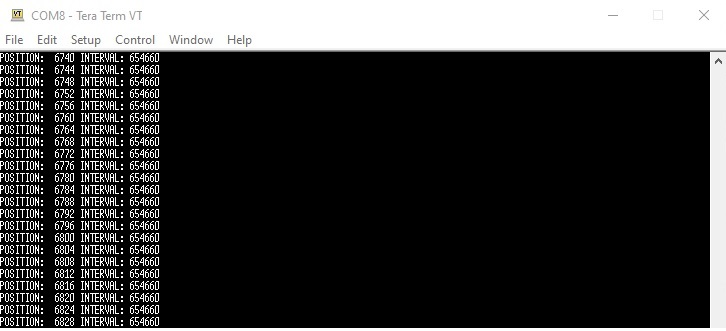

# XMC&trade; MCU: POSIF QD

This example demonstrates a Position Interface (POSIF) module in Quadrature Decoder (QD) mode and uses the CCU40 module to determine the speed of rotation of the encoder. LED1 turns ON when the encoder rotates in a clockwise direction; LED2 turns ON when the rotation is anti-clockwise.

## Requirements

- [ModusToolbox&trade; software](https://www.infineon.com/modustoolbox) v3.0
- [SEGGER J-Link software](https://www.segger.com/downloads/jlink/#J-LinkSoftwareAndDocumentationPack)
- Programming language: C
- Associated parts: All [XMC™ MCU](https://www.infineon.com/cms/en/product/microcontroller/32-bit-industrial-microcontroller-based-on-arm-cortex-m/) parts

## Supported toolchains (make variable 'TOOLCHAIN')

- GNU Arm&reg; embedded compiler v10.3.1 (`GCC_ARM`) - Default value of `TOOLCHAIN`
- Arm&reg; compiler v6.16 (`ARM`)
- IAR C/C++ compiler v9.30.1 (`IAR`)

## Supported kits (make variable 'TARGET')

- [XMC1400 boot kit](https://www.infineon.com/cms/en/product/evaluation-boards/kit_xmc14_boot_001/) (`KIT_XMC14_BOOT_001`) - Default value of `TARGET`
- [XMC4700 relax kit](https://www.infineon.com/cms/en/product/evaluation-boards/kit_xmc47_relax_v1/) (`KIT_XMC47_RELAX_V1`)

## Hardware setup

This example uses the board's default configuration. See the kit user guide to ensure that the board is configured correctly.

Tables 1 and 2 show the input signal connections from the encoder to ports in XMC1400 and XMC4700 kits.

**Table 1. Input connections in XMC1400 boot kit**

Input signal       |    Ports     
-----------------------------------|------------------
Phase A input signal      |    Port P0.13   
Phase B input signal      |    Port P1.1
Index signal          |    Port P1.0

**Table 2. Input connections in XMC4700 relax kit**

 Input signal       |    Ports
-----------------------------------|------------------
Phase A input signal      |    Port P14.7  
Phase B input signal      |    Port P14.6    
Index signal          |    Port P1.1     

For XMC1400 boot kit, connect P1.0 (Index signal) to P0.7 (CCU40.CC41/Event0 input signal).

## Software setup

Install a terminal emulator if you don't have one. Instructions in this document use [Tera Term](https://ttssh2.osdn.jp/index.html.en).

## Using the code example

Create the project and open it using one of the following:

<details open><summary><b>In Eclipse IDE for ModusToolbox&trade; software</b></summary>

1. Click the **New Application** link in the **Quick Panel** (or, use **File** > **New** > **ModusToolbox Application**). This launches the [Project Creator](https://www.infineon.com/ModusToolboxProjectCreator) tool.

2. Pick a kit supported by the code example from the list shown in the **Project Creator - Choose Board Support Package (BSP)** dialog.

   When you select a supported kit, the example is reconfigured automatically to work with the kit. To work with a different supported kit later, use the [Library Manager](https://www.infineon.com/ModusToolboxLibraryManager) to choose the BSP for the supported kit. You can use the Library Manager to select or update the BSP and firmware libraries used in this application. To access the Library Manager, click the link from the **Quick Panel**.

   You can also just start the application creation process again and select a different kit.

   If you want to use the application for a kit not listed here, you may need to update the source files. If the kit does not have the required resources, the application may not work.

3. In the **Project Creator - Select Application** dialog, choose the example by enabling the checkbox.

4. (Optional) Change the suggested **New Application Name**.

5. The **Application(s) Root Path** defaults to the Eclipse workspace which is usually the desired location for the application. If you want to store the application in a different location, you can change the *Application(s) Root Path* value. Applications that share libraries should be in the same root path.

6. Click **Create** to complete the application creation process.

For more details, see the [Eclipse IDE for ModusToolbox&trade; software user guide](https://www.infineon.com/MTBEclipseIDEUserGuide) (locally available at *{ModusToolbox&trade; software install directory}/ide_{version}/docs/mtb_ide_user_guide.pdf*).

</details>

<details open><summary><b>In command-line interface (CLI)</b></summary>

ModusToolbox&trade; software provides the Project Creator as both a GUI tool and the command line tool, "project-creator-cli". The CLI tool can be used to create applications from a CLI terminal or from within batch files or shell scripts. This tool is available in the *{ModusToolbox&trade; software install directory}/tools_{version}/project-creator/* directory.

Use a CLI terminal to invoke the "project-creator-cli" tool. On Windows, use the command line "modus-shell" program provided in the ModusToolbox&trade; software installation instead of a standard Windows command-line application. This shell provides access to all ModusToolbox&trade; software tools. You can access it by typing `modus-shell` in the search box in the Windows menu. In Linux and macOS, you can use any terminal application.

This tool has the following arguments:

Argument | Description | Required/optional
---------|-------------|-----------
`--board-id` | Defined in the `<id>` field of the [BSP](https://github.com/Infineon?q=bsp-manifest&type=&language=&sort=) manifest | Required
`--app-id`   | Defined in the `<id>` field of the [CE](https://github.com/Infineon?q=ce-manifest&type=&language=&sort=) manifest | Required
`--target-dir`| Specify the directory in which the application is to be created if you prefer not to use the default current working directory | Optional
`--user-app-name`| Specify the name of the application if you prefer to have a name other than the example's default name | Optional

<br>

The following example will clone the "[POSIF QD](https://github.com/Infineon/mtb-example-xmc-posif-qd)" application with the desired name "POSIFQD" configured for the *KIT_XMC14_BOOT_001* BSP into the specified working directory, *C:/mtb_projects*:

   ```
   project-creator-cli --board-id KIT_XMC14_BOOT_001 --app-id mtb-example-xmc-posif-qd --user-app-name POSIFQD --target-dir "C:/mtb_projects"
   ```

**Note:** The project-creator-cli tool uses the `git clone` and `make getlibs` commands to fetch the repository and import the required libraries. For details, see the "Project creator tools" section of the [ModusToolbox&trade; software user guide](https://www.infineon.com/ModusToolboxUserGuide) (locally available at *{ModusToolbox&trade; software install directory}/docs_{version}/mtb_user_guide.pdf*).

</details>

<details open><summary><b>In third-party IDEs</b></summary>

**Note:** Only VS Code is supported.

1. Follow the instructions from the **In command-line interface (CLI)** section to create the application, and import the libraries using the `make getlibs` command.

2. Export the application to a supported IDE using the `make <ide>` command.

   For a list of supported IDEs and more details, see the "Exporting to IDEs" section of the [ModusToolbox&trade; software user guide](https://www.infineon.com/ModusToolboxUserGuide) (locally available at *{ModusToolbox&trade; software install directory}/docs_{version}/mtb_user_guide.pdf*).

3. Follow the instructions displayed in the terminal to create or import the application as an IDE project.

</details>

## Operation

1. Connect the board to your PC using a micro-USB cable through the debug USB connector.

2. Open a terminal program and select the KitProg3 COM port. Set the serial port parameters to 8N1 and 115200 baud.

3. Program the board using Eclipse IDE for ModusToolbox&trade; software:

   1. Select the application project in the Project Explorer.

   2. In the **Quick Panel**, scroll down, and click **\<Application Name> Program (JLink)**.

4. Connect Phase A, Phase B, and index signals from the external encoder to posif module input pins as mentioned in the [Hardware setup](#hardware-setup) section.

3. Confirm the operation of the example:

   1. Confirm that USER_LED1 turns ON when the encoder rotates in the clockwise direction.

   2. Confirm that USER_LED2 turns ON when the motor encoder rotates in the anti-clockwise direction.

4. Confirm that the index signal time period is displayed on the UART terminal as shown below.

**Figure 1. Terminal output**



<br>

## Debugging

You can debug the example to step through the code. In the IDE, use the **\<Application Name> Debug (JLink)** configuration in the **Quick Panel**. For more details, see the "Program and debug" section in the [Eclipse IDE for ModusToolbox&trade; user guide](https://www.infineon.com/MTBEclipseIDEUserGuide).

## Design and implementation

The application uses the 'CYBSP_DEBUG_UART' resource to print messages in a UART terminal emulator. This resource is configured by the ModusToolbox&trade; UART personality. The retargeting of the standard I/O to the CYBSP_DEBUG_UART port is included in the example. After using `retarget_io_init`, messages can be printed on the terminal by using `printf` commands.

The POSIF module is configured in Quadrature Decoder mode. Within this mode, standard mode is selected, which is used when the external rotary encoder provides two-phase signals and additionally an index signal that is generated once per shaft revolution. Encoder signals are connected to the POSIF module input ports. The POSIF0.OUT1 pin from the POSIF module is asserted HIGH when the encoder is rotating clockwise and LOW when it is rotating in an anti-clockwise direction.

The application uses a CCU4 slice configured using the CCU4 personality. The CAPTURE_0 CCU4 slice is configured in capture mode. It will capture the timer value on the rising edge of the index signal.

In the main loop, the direction is continuously monitored; USER_LED1 turns ON when the motor rotates in a clockwise direction and USER_LED2 turns ON when the motor rotates in an anti-clockwise direction. It also checks for the occurrence of the rising edge event of the index signal, reads out the captured timer, and prints the index signal time period on the terminal.

### Resources and settings

The project uses a custom *design.modus* file because the following settings were modified in the default *design.modus* file.

**Figure 2. CCU40 configuration for XMC1400 boot kit**


<br>

**Figure 3. CCU40 configuration for XMC4700 relax kit**


<br>

**Figure 4. Phase_A pin settings for XMC1400 boot kit**


<br>

**Figure 5. Phase_B pin settings for XMC1400 boot kit**


<br>

**Figure 6. Index signal pin settings for XMC1400 boot kit**


<br>

**Figure 7. P0.7 pin settings for XMC1400 boot kit**


<br>

**Figure 8. Phase_A pin settings for XMC4700 relax kit**


<br>

**Figure 9. Phase_B pin settings for XMC4700 relax kit**


<br>

**Figure 10. Index signal pin settings for XMC4700 relax kit**


<br>

## Related resources

Resources  | Links
-----------|----------------------------------
Code examples  | [Using ModusToolbox&trade; software](https://github.com/Infineon/Code-Examples-for-ModusToolbox-Software) on GitHub
Kit guides  | [XMC4700/XMC4800 relax kit series-V1](https://www.infineon.com/dgdl/Infineon-Board_User_Manual_XMC4700_XMC4800_Relax_Kit_Series-UM-v01_02-EN.pdf?fileId=5546d46250cc1fdf01513f8e052d07fc) – The schematic and hardware of the XMC4700/XMC4800 relax kit series-V1 board user‘s manual <br> [XMC1400 boot kit](https://www.infineon.com/dgdl/Infineon-Board_Users_Manual_XMC1400_Boot_Kit.pdf-UM-v01_00-EN.pdf?fileId=5546d462525dbac401527815f9a073fd) – The schematic and hardware of the XMC1400 boot kit for application code development on the XMC1404-Q064X0200 device board user‘s manual
Device documentation | [XMC1000 family datasheets](https://www.infineon.com/cms/en/product/microcontroller/32-bit-industrial-microcontroller-based-on-arm-cortex-m/32-bit-xmc1000-industrial-microcontroller-arm-cortex-m0/#document-group-myInfineon-49) <br> [XMC1000 family technical reference manuals](https://www.infineon.com/cms/en/product/microcontroller/32-bit-industrial-microcontroller-based-on-arm-cortex-m/32-bit-xmc1000-industrial-microcontroller-arm-cortex-m0/#document-group-myInfineon-44) <br> [XMC4000 family datasheets](https://www.infineon.com/cms/en/product/microcontroller/32-bit-industrial-microcontroller-based-on-arm-cortex-m/32-bit-xmc4000-industrial-microcontroller-arm-cortex-m4/#document-group-myInfineon-49) <br> [XMC4000 family technical reference manuals](https://www.infineon.com/cms/en/product/microcontroller/32-bit-industrial-microcontroller-based-on-arm-cortex-m/32-bit-xmc4000-industrial-microcontroller-arm-cortex-m4/#document-group-myInfineon-44) <br> [AP32289 position interface (POSIF)](https://www.infineon.com/dgdl/Infineon-POSIF-XMC1000_XMC4000-AP32289-AN-v01_00-EN.pdf?fileId=5546d4624e765da5014ed938a6a7311f)
Development kits | [XMC&trade; eval boards](https://www.infineon.com/cms/en/product/microcontroller/32-bit-industrial-microcontroller-based-on-arm-cortex-m/#boards)
Libraries on GitHub | [mtb-xmclib-cat3](https://github.com/Infineon/mtb-xmclib-cat3) – XMC&trade; MCU peripheral library (XMCLib) and docs
Tools | [Eclipse IDE for ModusToolbox&trade; software](https://www.infineon.com/modustoolbox) – ModusToolbox&trade; software is a collection of easy-to-use software and tools enabling rapid development with Infineon MCUs, covering applications from embedded sense and control to wireless and cloud-connected systems using AIROC&trade; Wi-Fi and Bluetooth® connectivity devices.

## Other resources

Infineon provides a wealth of data at www.infineon.com to help you select the right device, and quickly and effectively integrate it into your design.

For XMC&trade; MCU devices, see [32-bit XMC™ industrial microcontroller based on Arm® Cortex®-M](https://www.infineon.com/cms/en/product/microcontroller/32-bit-industrial-microcontroller-based-on-arm-cortex-m/).

## Document history

Document title: *CE232707* - *XMC&trade; MCU: POSIF QD*

 Version | Description of change
 ------- | ---------------------
 1.0.0   | New code example
 2.0.0   | Updated to support ModusToolbox™ software v3.0; CE will not be backward compatible with previous versions of ModusToolbox™ software
------

All other trademarks or registered trademarks referenced herein are the property of their respective owners.

© 2022 Infineon Technologies AG

All Rights Reserved.

### Legal disclaimer

The information given in this document shall in no event be regarded as a guarantee of conditions or characteristics. With respect to any examples or hints given herein, any typical values stated herein and/or any information regarding the application of the device, Infineon Technologies hereby disclaims any and all warranties and liabilities of any kind, including without limitation, warranties of non-infringement of intellectual property rights of any third party.

### Information

For further information on technology, delivery terms and conditions and prices, please contact the nearest Infineon Technologies Office (www.infineon.com).

### Warnings

Due to technical requirements, components may contain dangerous substances. For information on the types in question, please contact the nearest Infineon Technologies Office.

Infineon Technologies components may be used in life-support devices or systems only with the express written approval of Infineon Technologies, if a failure of such components can reasonably be expected to cause the failure of that life-support device or system or to affect the safety or effectiveness of that device or system. Life support devices or systems are intended to be implanted in the human body or to support and/or maintain and sustain and/or protect human life. If they fail, it is reasonable to assume that the health of the user or other persons may be endangered.

-------------------------------------------------------------------------------
